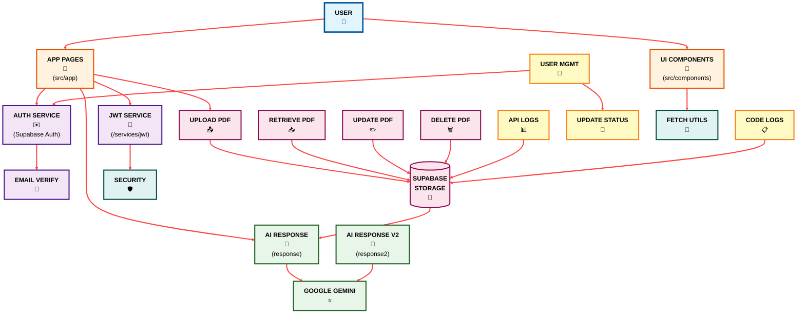
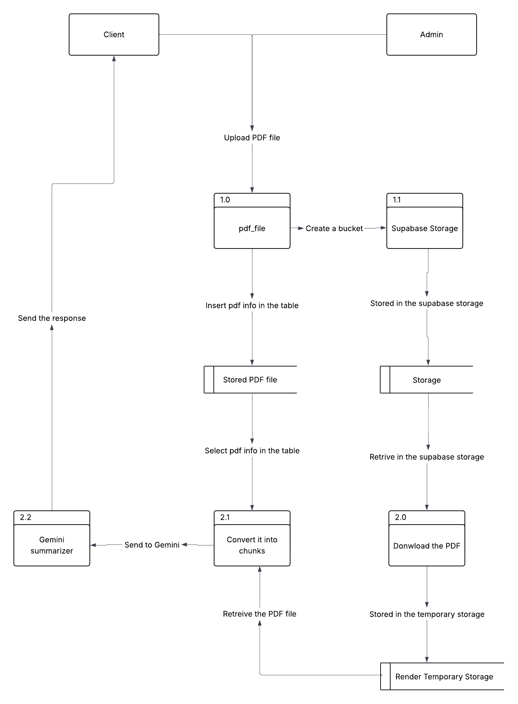
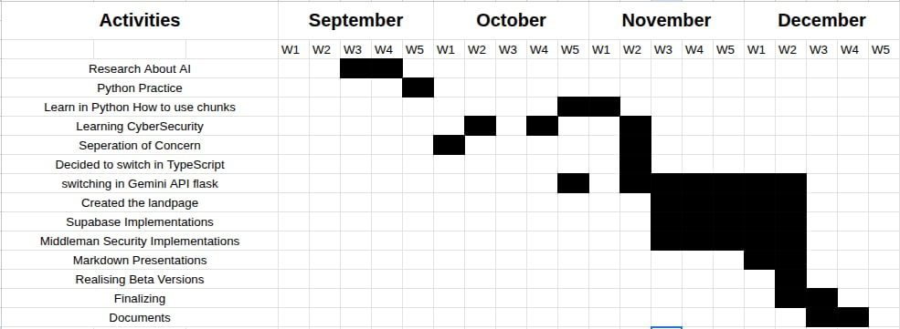

# LACO AI - Intelligent PDF Analysis System

**Author**: [cordyStackX](https://github.com/cordyStackX) | **Year**: 2025


## 🎯 Project Overview

**LACO AI** is an advanced AI-powered PDF analysis and summarization system designed for La Consolacion College Bacolod (LCCB). This educational project leverages cutting-edge artificial intelligence to transform how students and educators interact with academic documents.

### ⚠️ Beta Version Notice
This is a **BETA VERSION** for educational and research purposes only. Not intended for production or commercial use.

---

## ✨ Key Features

### 📄 Intelligent PDF Processing
- **Smart Summarization**: Automatically generate concise summaries of lengthy PDF documents
- **Context-Aware Analysis**: AI understands document structure and extracts key information

### 💬 Interactive AI Chat
- **Ask Questions**: Query your documents and receive accurate, context-based answers
- **Real-time Responses**: Powered by Google Gemini AI for instant feedback
- **Conversation Memory**: Maintains chat history for continuous dialogue

### 🔒 Security & Privacy
- **Temporary Storage**: Uploaded PDFs automatically deleted after 5 minutes
- **Encrypted Authentication**: Secure JWT-based user authentication
- **No Data Collection**: Privacy-first approach - your documents remain confidential

### 🎨 Modern User Interface
- **Responsive Design**: Works seamlessly on desktop, tablet, and mobile devices
- **Interactive 3D Effects**: Engaging visual effects using Three.js and React Three Fiber
- **Intuitive Navigation**: User-friendly dashboard and chat interface

---

## 🛠️ Technology Stack

### Frontend
- **Framework**: Next.js 15 (React 19)
- **Language**: TypeScript
- **Styling**: CSS Modules with adaptive theming
- **3D Graphics**: Three.js, React Three Fiber (@react-three/fiber, @react-three/drei)
- **State Management**: React Hooks (useState, useEffect, useRef)
- **Routing**: Next.js App Router

### Backend
- **API Framework**: Flask (Python)
- **AI Engine**: Google Gemini 2.5 Flash
- **PDF Processing**: PyPDF2
- **Database**: Supabase (PostgreSQL)
- **Authentication**: JWT tokens
- **File Storage**: Supabase Storage

### DevOps & Tools
- **Package Manager**: pnpm
- **Code Quality**: ESLint, TypeScript
- **Version Control**: Git & GitHub
- **Deployment**: Render (Python API), Vercel-ready (Next.js)

---

## 🏗️ System Architecture

LACO AI follows a **Service-Oriented Architecture (SOA)** for modularity and scalability.


---

## 📊 Use Cases

### Installation & Setup

#### Option 1: Automated Setup (Recommended)

1. Clone the repository:
   ```bash
   git clone https://github.com/cordyStackX/lccb_ai_2.git
   cd lccb_ai_2
   ```

2. Run the automated setup script:
   ```bash
   chmod +x setup.sh
   ./setup.sh
   ```

3. The script will:
   - Install Node.js dependencies
   - Set up Python virtual environment
   - Install Python packages
   - Configure environment variables
   - Start both Next.js and Flask servers

4. Open your browser and navigate to:
   - **Frontend**: [http://localhost:3000](http://localhost:3000)
   - **API**: [http://localhost:10000](http://localhost:10000)

#### Option 2: Manual Setup

**Frontend Setup:**
```bash
# Install dependencies
pnpm install

# Run development server
pnpm dev
```

**Backend Setup:**
```bash
# Navigate to Python directory
cd python

# Create virtual environment
python3 -m venv .venv
source .venv/bin/activate  # On Windows: .venv\Scripts\activate

# Install dependencies
pip install -r requirements.txt

# Run Flask server
python main.py
```

---

## 📖 User Guide

### 1. Registration & Login
- Navigate to `/auth/signup` to create an account
- Verify email through confirmation link
- Login at `/auth/signin`
- Secure JWT-based authentication

### 2. Uploading PDFs
- Access the dashboard after login
- Click "Upload PDF" button
- Select your PDF file (supports large files up to 900+ pages)
---

## 🎨 Design & User Experience

### Visual Design
- **Modern UI**: Clean, minimalist interface with adaptive theming
- **3D Effects**: Interactive sphere with distortion effects using Three.js
- **Responsive Layout**: Optimized for all screen sizes
- **Accessibility**: WCAG-compliant color contrast and keyboard navigation

### User Flow
1. **Landing Page** → Feature overview and project description
2. **Authentication** → Secure signup/login with email verification
## ⚡ **How It Works**

### Request Flow
1. **User Interaction** → Frontend components (React/Next.js)
2. **API Request** → Next.js API routes handle client requests
3. **Authentication** → JWT verification and user validation
4. **PDF Processing** → Python Flask server downloads and processes PDF
5. **AI Analysis** → Google Gemini AI analyzes content and generates response
6. **Database Logging** → Supabase records API usage and user actions
7. **Response Delivery** → AI-generated answer returned to frontend
8. **Auto-Cleanup** → Temporary files deleted after 5 minutes

### Technical Workflow
```
User → Next.js UI → API Routes → JWT Auth → Flask API 
→ Supabase Storage → PDF Processing → Gemini AI 
→ Response → Database Log → User Display
```

---

## 🐛 Known Issues & Limitations

### Current Limitations
- **Beta Version**: May contain bugs and unexpected behavior
- **Large PDFs**: 900+ page documents may experience processing delays
- **API Limits**: Subject to Google Gemini API rate limits
- **Temporary Storage**: Files auto-delete after 5 minutes
- **No Offline Mode**: Requires internet connection for AI processing

### Planned Improvements
- [ ] Enhanced PDF chunking algorithm for better context retention
- [ ] Support for more document formats (DOCX, TXT, etc.)
- [ ] Conversation history export
- [ ] Multi-language support
- [ ] Advanced search within documents
- [ ] Document comparison feature

---

## 🤝 Contributing

We welcome contributions from the community! This is an educational open-source project.

### How to Contribute
1. Fork the repository
2. Create a feature branch (`git checkout -b feature/AmazingFeature`)
3. Commit your changes (`git commit -m 'Add some AmazingFeature'`)
4. Push to the branch (`git push origin feature/AmazingFeature`)
5. Open a Pull Request

### Development Guidelines
- Follow existing code style and conventions
- Write clear commit messages
- Test your changes thoroughly
- Update documentation as needed
- Respect the Apache 2.0 license

---

## 📄 License

This project is licensed under the **Apache License 2.0** - see the [LICENSE](LICENSE) file for details.

### Key Points
- ✅ Free to use, modify, and distribute
- ✅ Must include license and copyright notice
- ✅ State significant changes made
- ❌ No warranty provided
- ❌ Contributors not liable for damages

**Copyright © 2025 cordyStackX**

---

## 👨‍💻 Project Information

### Developer
- **Name**: cordyStackX
- **GitHub**: [@cordyStackX](https://github.com/cordyStackX)
- **Repository**: [lccb_ai_2](https://github.com/cordyStackX/lccb_ai_2)

### Project Stats
- **Version**: Beta
- **Started**: 2025
- **Language**: TypeScript, Python
- **Framework**: Next.js, Flask
- **AI Model**: Google Gemini 2.5 Flash

---

## 📞 Support & Contact

### For Questions or Issues
- Open an issue on [GitHub Issues](https://github.com/cordyStackX/lccb_ai_2/issues)
- Check existing documentation and README
- Review [Privacy Policy](/privacy) and [Terms & Conditions](/terms)

### Important Links
- **Privacy Policy**: [/privacy](/privacy)
- **Terms & Conditions**: [/terms](/terms)
- **Security Policy**: [SECURITY.md](SECURITY.md)
- **Apache License**: [http://www.apache.org/licenses/LICENSE-2.0](http://www.apache.org/licenses/LICENSE-2.0)

---

## 🌟 Acknowledgments

- **La Consolacion College Bacolod** - Inspiration and educational purpose
- **Google Gemini AI** - Powerful AI processing capabilities
- **Supabase** - Database and authentication infrastructure
- **Next.js Team** - Excellent web framework
- **Open Source Community** - Libraries and tools used in this project

---

## ⚠️ Disclaimer

**IMPORTANT NOTICE:**

This is a **BETA VERSION** educational research project. By using this software, you acknowledge:

- ✅ This is for **educational and research purposes only**
- ✅ Not intended for production or commercial use
- ✅ Provided "AS IS" without warranties
- ✅ May contain bugs, errors, or unexpected behavior
- ✅ Subject to changes or discontinuation without notice
- ❌ Do not upload sensitive or confidential information
- ❌ No illegal activities supported or condoned
- ❌ No guarantees of data security or availability

**Use at your own risk. The developers and contributors are not liable for any damages or losses arising from the use of this software.**

---

## 📚 Additional Resources

### Documentation
- [Next.js Documentation](https://nextjs.org/docs)
- [React Three Fiber](https://docs.pmnd.rs/react-three-fiber)
- [Google Gemini AI](https://ai.google.dev/)
- [Supabase Docs](https://supabase.com/docs)

### Tutorials
- [Flask REST API Tutorial](https://flask.palletsprojects.com/)
- [TypeScript Handbook](https://www.typescriptlang.org/docs/)
- [JWT Authentication Guide](https://jwt.io/introduction)

---

✅ **Result:**  
LACO AI is a **hybrid SOA system** combining modern web technologies with powerful AI capabilities to revolutionize document interaction for educational purposes.

- *Frontend* acts as the **service consumer**
- *Next.js API routes* as the **middleware layer**
- *Python Flask* as the **AI service provider**
- *Supabase* as the **data and storage layer**he dashboard
- Delete documents when no longer needed
- Documents auto-delete after 5 minutes for security

---

## 🔒 Security & Privacy

### Data Protection
- **Temporary Storage**: PDFs deleted automatically after 5 minutes
- **Encrypted Passwords**: Industry-standard encryption (bcrypt)
- **JWT Authentication**: Secure token-based sessions
- **API Key Protection**: All endpoints require authentication
- **No External Data Collection**: Your documents stay private

### Compliance
- Apache License 2.0
- Educational use only
- No illegal activities supported
- GDPR-conscious design (no unnecessary data retention)

---

## 🎓 Educational Purpose

This project is developed strictly for:
- ✅ Educational research and learning
- ✅ Academic experimentation
- ✅ Technology demonstration
- ✅ Open-source contribution

**Not intended for:**
- ❌ Commercial use
- ❌ Production deployment
- ❌ Processing sensitive/confidential data
- ❌ Any illegal activities

## 🚀 Getting Started

### Prerequisites
- Node.js 18+ and pnpm
- Python 3.13+
- Ubuntu/Linux environment (WSL supported)
- Google Gemini API key
- Supabase account

### Environment Variables
Create a `.env.local` file in the project root:

```env
# Google AI
GOOGLE_API_KEY=your_gemini_api_key

# API Security
API_KEY=your_secure_api_key

# Supabase
SUPABASE_URL=your_supabase_url
SUPABASE_SERVICE_ROLE_KEY=your_service_role_key

# Optional
RENDER_API=your_render_api_url
PORT=10000
```

**Disclaimer:** This project does **not** collect any user data for external purposes. All data is processed securely and stored temporarily.

---

## 📊 Project Diagrams

### Data Flow Diagram (DFD)

The Data Flow Diagram illustrates how data moves through the LACO AI system, from user input to AI-generated output.



**Key Data Flows:**
- User uploads PDF → Supabase Storage
- PDF retrieval → Python Flask API
- PDF text extraction → Google Gemini AI
- AI response → User interface
- Activity logging → Supabase Database

---

### Context Free Diagram (CFD)

The Context Diagram shows the system boundaries and external entities that interact with LACO AI.


**External Entities:**
- **Users**: Students, Educators, Researchers
- **Google Gemini AI**: AI processing service
- **Supabase**: Database and storage provider
- **Email Service**: Authentication and notifications

---

## 📅 Project Timeline (Gantt Chart)

Development timeline and milestones for the LACO AI project.




## Directory Tree

```bash
src
├── app
│   ├── favicon.ico
│   ├── globals.css
│   ├── layout.tsx
│   ├── not-found.module.css
│   ├── not-found.tsx
│   ├── (pages)
│   │   ├── admin
│   │   │   ├── chatbot
│   │   │   │   └── page.tsx
│   │   │   ├── dashboard
│   │   │   │   └── page.tsx
│   │   │   ├── manageuser
│   │   │   │   └── page.tsx
│   │   │   └── setting
│   │   │       └── page.tsx
│   │   ├── auth
│   │   │   ├── confirm-email-forgot-pwd
│   │   │   │   └── page.tsx
│   │   │   ├── confirm-email-signin
│   │   │   │   └── page.tsx
│   │   │   ├── confirm-email-signup
│   │   │   │   └── page.tsx
│   │   │   ├── create-password
│   │   │   │   └── page.tsx
│   │   │   ├── forgot-password
│   │   │   │   └── page.tsx
│   │   │   ├── signin
│   │   │   │   └── page.tsx
│   │   │   ├── signup
│   │   │   │   └── page.tsx
│   │   │   └── update-password
│   │   │       └── page.tsx
│   │   ├── chat_bot
│   │   │   └── page.tsx
│   │   ├── privacy
│   │   │   └── page.tsx
│   │   ├── terms
│   │   │   └── page.tsx
│   │   └── user
│   │       └── settings
│   │           └── page.tsx
│   ├── page.tsx
│   └── services
│       ├── api
│       │   ├── response
│       │   │   └── route.ts
│       │   └── response2
│       │       └── route.ts
│       ├── jwt
│       │   ├── auth
│       │   │   └── route.ts
│       │   ├── deauth
│       │   │   └── route.ts
│       │   └── verify
│       │       └── route.ts
│       └── supabase
│           ├── admin
│           │   ├── delete_user
│           │   │   └── route.ts
│           │   ├── retrieve_API_logs
│           │   │   └── route.ts
│           │   ├── retrieve_code_logs
│           │   │   └── route.ts
│           │   ├── retrieve_user
│           │   │   └── route.ts
│           │   └── update_user_status
│           │       └── route.ts
│           ├── auth
│           │   ├── check_code
│           │   │   └── route.ts
│           │   ├── check_status
│           │   │   └── route.ts
│           │   ├── forgot_password
│           │   │   ├── check_email
│           │   │   │   └── route.ts
│           │   │   └── update_account
│           │   │       └── route.ts
│           │   ├── signin
│           │   │   └── route.ts
│           │   └── signup
│           │       ├── check_email
│           │       │   └── route.ts
│           │       └── create_account
│           │           └── route.ts
│           ├── health
│           │   └── route.ts
│           └── storage
│               ├── deletepdf
│               │   └── route.ts
│               ├── retrieve
│               │   └── route.ts
│               ├── updatepdf
│               │   └── route.ts
│               └── uploadpdf
│                   └── route.ts
├── components
│   ├── admin
│   │   ├── chat_bot
│   │   │   ├── css
│   │   │   │   └── styles.module.css
│   │   │   └── index.tsx
│   │   ├── dashboard
│   │   │   ├── css
│   │   │   │   └── styles.module.css
│   │   │   └── index.tsx
│   │   ├── index.ts
│   │   ├── manage_user
│   │   │   ├── css
│   │   │   │   └── styles.module.css
│   │   │   └── index.tsx
│   │   ├── setting
│   │   │   ├── css
│   │   │   │   └── styles.module.css
│   │   │   └── index.tsx
│   │   └── sidebar
│   │       ├── css
│   │       │   └── styles.module.css
│   │       └── index.tsx
│   ├── auth
│   │   ├── confirm_email_forgot_pwd
│   │   │   ├── css
│   │   │   │   └── styles.module.css
│   │   │   └── index.tsx
│   │   ├── confirm_email_signin
│   │   │   ├── css
│   │   │   │   └── styles.module.css
│   │   │   └── index.tsx
│   │   ├── confirm_email_signup
│   │   │   ├── css
│   │   │   │   └── styles.module.css
│   │   │   └── index.tsx
│   │   ├── create_password
│   │   │   ├── css
│   │   │   │   └── styles.module.css
│   │   │   └── index.tsx
│   │   ├── forgot_password
│   │   │   ├── css
│   │   │   │   └── styles.module.css
│   │   │   └── index.tsx
│   │   ├── index.ts
│   │   ├── signin
│   │   │   ├── css
│   │   │   │   └── styles.module.css
│   │   │   └── index.tsx
│   │   ├── signup
│   │   │   ├── css
│   │   │   │   └── styles.module.css
│   │   │   └── index.tsx
│   │   └── update_password
│   │       ├── css
│   │       │   └── styles.module.css
│   │       └── index.tsx
│   ├── chat_bot
│   │   ├── header
│   │   │   ├── css
│   │   │   │   └── styles.module.css
│   │   │   └── index.tsx
│   │   ├── index.ts
│   │   ├── main
│   │   │   ├── css
│   │   │   │   └── styles.module.css
│   │   │   └── index.tsx
│   │   └── sidebars
│   │       ├── css
│   │       │   └── styles.module.css
│   │       └── index.tsx
│   ├── disclaimer
│   │   ├── index.ts
│   │   ├── privacy
│   │   │   ├── css
│   │   │   │   └── styles.module.css
│   │   │   └── index.tsx
│   │   └── terms
│   │       ├── css
│   │       │   └── styles.module.css
│   │       └── index.tsx
│   ├── landpage
│   │   ├── banner
│   │   │   ├── css
│   │   │   │   └── styles.module.css
│   │   │   └── index.tsx
│   │   ├── chat_bot
│   │   │   ├── css
│   │   │   │   └── styles.module.css
│   │   │   └── index.tsx
│   │   ├── chat_bot_ask
│   │   │   ├── css
│   │   │   │   └── styles.module.css
│   │   │   └── index.tsx
│   │   ├── fx_effect
│   │   │   ├── css
│   │   │   │   └── styles.module.css
│   │   │   └── index.tsx
│   │   ├── header
│   │   │   ├── css
│   │   │   │   └── styles.module.css
│   │   │   └── index.tsx
│   │   └── index.ts
│   └── user
│       ├── dashboard
│       │   └── index.ts
│       └── index.ts
├── config
│   ├── conf
│   │   ├── css_config
│   │   │   ├── background_colors.css
│   │   │   ├── config.css
│   │   │   ├── display_flex.css
│   │   │   └── status.css
│   │   └── json_config
│   │       ├── Api_links.json
│   │       ├── fetch_url.json
│   │       └── Metadata.json
│   └── images_links
│       └── assets.json
├── lib
│   ├── code_store.ts
│   ├── security.ts
│   └── supabase-server.ts
├── modules
│   ├── formula
│   │   ├── Use_scroll_deg.ts
│   │   └── Use_scroll.ts
│   └── index.ts
└── utilities
    ├── Fetch_toFile.ts
    ├── Fetch_to.ts
    ├── index.ts
    ├── InView.ts
    ├── Meta_data.ts
    ├── Prevent_Exit.ts
    └── SweetAlert2.ts
```
