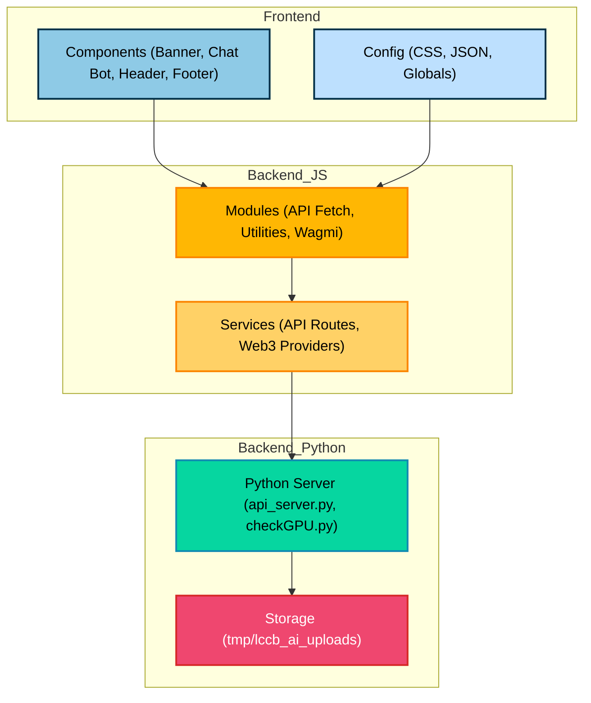

# About This Project

This project is an AI-powered PDF reader and assistant for La Consolacion College Bacolod.

With this app, you can:

- **Summarize PDF documents** using advanced Python AI models.
- **Ask questions** about your PDFs and get instant answers.
- **Chat with your documents** for a more interactive reading experience.

Built with Next.js and Python, this app combines modern web technologies and AI to help you work with documents smarter and faster.

# Getting Started

**Disclaimer:** This project does **not** collect any user data. All data is processed and stored locally on your machine.

## How to Run the Python API and Nextjs

1. Open this repository in your Codespace or clone to UBUNTU WSL.

2. In your terminal, run:

    ```sh
    ./setup.sh
    ```

3. Once setup is complete, open the web app

   [http://localhost:3000/](http://localhost:3000/)

## Config the RPC_Endpoint

1. Get your RPC at https://portal.cdp.coinbase.com/products/address-history

2. Config and Update the RPC_Endpoint in /src/app/config/conf/setting.json.

---

## Architecture Overview

LLCB AI is a modular AI project built using a **Service-Oriented Architecture (SOA)** approach.  
It integrates Web3 services, Python APIs, and frontend components for a scalable and maintainable system.

SOA (Service-Oriented Architecture) is a software design style where your system is divided into independent, reusable services that communicate with each other — usually over a network (like HTTP or APIs).

Each service does one specific job and can be used by different applications.
These services are loosely coupled, meaning they don’t depend on each other’s internal code — only on what they expose (like APIs).



---

## 🧩 **3. How LLCB AI Follows SOA**

| SOA Layer | Folder / Service | Description |
|------------|------------------|--------------|
| **Service Consumers** | `src/app/components` | The **frontend UI** — users interact here (Banner, Chat Bot, Header, Footer). |
| **Configuration Layer** | `src/app/config` | Contains CSS and JSON settings that define global behaviors and styles. |
| **Business Logic / Middleware** | `src/app/modules` | Handles **API calls**, utilities like `Airdrop.js`, and Web3 integrations using Wagmi. |
| **Service Providers** | `src/app/services` | Provides REST APIs like `/api/ask__ai`, `/api/check__connections`, and blockchain providers. |
| **Backend Processing** | `python/` | Python-based AI processing (e.g., `api_server.py`, `checkGPU.py`) acting as the **AI engine**. |
| **Storage / Data Layer** | `python/tmp/lccb_ai_uploads` | Local file storage for uploaded PDFs and AI documents. |

---

## ⚡ **4. How It Works**

1. **Frontend (React)** → Users interact with UI components.  
2. **Modules** → Handle logic like asking AI (`HandleAsk.js`) or checking wallet connection.  
3. **Services (API routes)** → Act as gateways to connect JS frontend to backend (JS or Python).  
4. **Python backend** → Performs AI and GPU-based computations.  
5. **Storage** → Saves uploaded user files for future processing.  

---

✅ **Result:**  
Your LLCB AI project is basically a **hybrid SOA system** —  
- *Frontend* acts as the **consumer**,  
- *JS modules & APIs* as the **middleware**,  
- *Python backend* as the **service provider**,  
- *Storage* as the **data layer**.  

---

## Directory Tree

```bash
src
├── app
│   ├── components
│   │   ├── Banner
│   │   │   └── index.jsx
│   │   ├── Chat_bot
│   │   │   └── index.jsx
│   │   ├── Footer
│   │   │   └── index.jsx
│   │   ├── GlobalImports.js
│   │   └── Header
│   │       └── index.jsx
│   ├── config
│   │   ├── conf
│   │   │   ├── claimed.json
│   │   │   ├── root__config.css
│   │   │   └── setting.json
│   │   └── css
│   │       └── landpage
│   │           ├── banner.css
│   │           ├── chatbot.css
│   │           ├── global.css
│   │           └── header.css
│   ├── favicon.ico
│   ├── globals.css
│   ├── layout.js
│   ├── modules
│   │   ├── apis__fetch
│   │   │   ├── CheckConnections.js
│   │   │   ├── HandleAsk.js
│   │   │   └── HandleSubmit.js
│   │   ├── Modules__Imports.js
│   │   ├── utilitis
│   │   │   ├── Airdrop.js
│   │   │   └── SweetAlert2.js
│   │   └── Wagmi
│   │       ├── wagmi__client.js
│   │       └── wagmi__transactions.js
│   ├── page.js
│   └── services
│       ├── api
│       │   ├── airdrop
│       │   │   └── route.js
│       │   ├── ask__ai
│       │   │   └── route.js
│       │   ├── check__connections
│       │   │   └── route.js
│       │   └── Connect__python
│       │       └── route.js
│       └── web3_providers
│           ├── transactions
│           │   └── ERC20_ABI.json
│           └── Wallet__wagmi
│               └── coinbased__provider.js
└── python
    ├── api_server.py
    ├── checkGPU.py
    ├── __pycache__
    │   └── sample.cpython-313.pyc
    ├── sample.py
    └── tmp
        └── lccb_ai_uploads
            ├── 0xa0488357578fAEaf9e79050Fd6400Ef06C2867E4.pdf
            └── 0xD170b2A5441766ff39E1286a1dBD705D4735bFCe.pdf
```
