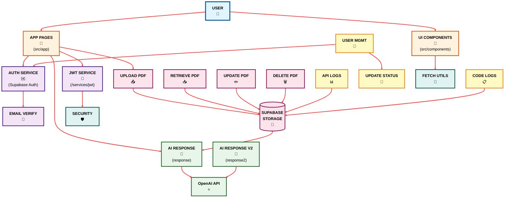
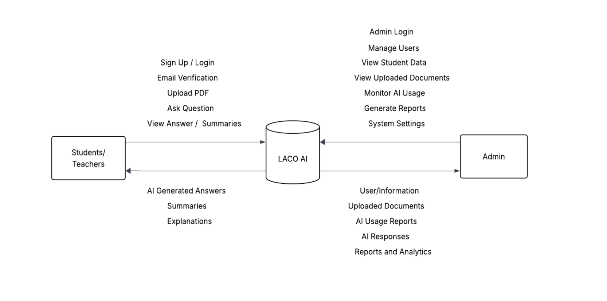

# LACO AI - Intelligent PDF Analysis System

**Developing Area**: [Development Page](https://lccb-ai-2-git-developingarea-cordystackg.vercel.app/)

**Author**: [cordyStackX](https://github.com/cordyStackX) | **Year**: 2025


## 🎯 Project Overview

**LACO AI** is an advanced AI-powered PDF analysis and summarization system designed for La Consolacion College Bacolod (LCCB). This educational project leverages cutting-edge artificial intelligence to transform how students and educators interact with academic documents.

### ⚠️ Beta Version Notice
This is a **BETA VERSION** for educational and research purposes only. Not intended for production or commercial use.

---

## ✨ Key Features

### 📄 Intelligent PDF Processing
- **Smart Summarization**: Automatically generate concise summaries of lengthy PDF documents
- **Context-Aware Analysis**: AI understands document structure and extracts key information
- **Multi-PDF Support**: Upload and manage multiple documents simultaneously
- **Search & Filter**: Find PDFs quickly by filename
- **Right-Click Management**: Delete PDFs easily via context menu

### 💬 Interactive AI Chat
- **Ask Questions**: Query your documents and receive accurate, context-based answers
- **Real-time Responses**: Powered by OpenAI for instant, intelligent feedback
- **Conversation Memory**: Maintains chat history for continuous dialogue
- **PDF Context**: Select specific PDFs to chat about with AI assistance
- **Streaming Responses**: Real-time AI response generation

### 👥 User Management & Roles
- **Role-Based Access**: Admin, Teacher, and Student permissions
- **Admin Dashboard**: User management, API logs, system monitoring
- **Teacher Supervision**: Monitor and filter content for students under 13
- **Student Accounts**: Independent access for users 13 and older
- **Profile Management**: Update name, upload profile pictures, change passwords

### 🔒 Security & Privacy
- **Persistent Storage**: PDFs stored securely until manually deleted via right-click context menu
- **Profile Pictures**: Upload and manage profile pictures with automatic updates
- **Encrypted Authentication**: Secure JWT-based user authentication with HTTP-only cookies
- **Rate Limiting**: 1 request per second per IP to prevent spam and abuse
- **CSRF Protection**: Origin validation and security headers
- **No External Data Sharing**: Privacy-first approach - your documents remain confidential
- **Email Verification**: Secure password reset with verification codes
- **Role-Based Access**: Admin, Teacher, and Student permissions

### 🎨 Modern User Interface
- **Responsive Design**: Works seamlessly on desktop, tablet, and mobile devices
- **Intuitive Navigation**: User-friendly dashboard and chat interface
- **Loading States**: SweetAlert2 notifications and progress indicators
- **Real-time Updates**: Instant feedback for user actions

---

## 🛠️ Technology Stack

### Frontend
- **Framework**: Next.js 15 (React 19)
- **Language**: TypeScript
- **Styling**: CSS Modules with adaptive theming
- **State Management**: React Hooks (useState, useEffect, useRef)
- **Routing**: Next.js App Router

### Backend
- **API Framework**: Flask (Python) via FastAPI on Render
- **AI Engine**: OpenAI (GPT-3.5-turbo / GPT-4)
- **PDF Processing**: PyPDF2, Python file handling
- **Database**: Supabase (PostgreSQL) with row-level security
- **Authentication**: JWT tokens with HTTP-only cookies
- **File Storage**: Supabase Storage (public and secure buckets)
- **Rate Limiting**: In-memory cooldown tracking (1 req/sec per IP)
- **Security**: CSRF protection, origin validation, bcrypt password hashing

### DevOps & Tools
- **Package Manager**: pnpm
- **Code Quality**: ESLint, TypeScript
- **Version Control**: Git & GitHub
- **Deployment**: Render (Python API), Vercel-ready (Next.js)

---

## 🏗️ System Architecture

LACO AI follows a **Service-Oriented Architecture (SOA)** for modularity and scalability.


```mermaid
%%{init: {'theme':'base', 'themeVariables': {'fontSize':'18px', 'fontFamily':'arial', 'lineColor':'#ff4444', 'primaryBorderColor':'#ff4444'}}}%%
flowchart TD
    %% ===== User Interface =====
    User["<b>USER</b><br/>👤"]
    
    %% ===== Presentation Layer =====
    UI_Pages["<b>APP PAGES</b><br/>📱<br/>(src/app)"]
    UI_Components["<b>UI COMPONENTS</b><br/>🎨<br/>(src/components)"]
    
    %% ===== Authentication Layer =====
    JWT_Service["<b>JWT SERVICE</b><br/>🔐<br/>(/services/jwt)"]
    Auth_Service["<b>AUTH SERVICE</b><br/>✉️<br/>(Supabase Auth)"]
    Email_Verification["<b>EMAIL VERIFY</b><br/>📧"]
    
    %% ===== AI Processing =====
    AI_Response["<b>AI RESPONSE</b><br/>🤖<br/>(response)"]
    AI_Response2["<b>AI RESPONSE V2</b><br/>🤖<br/>(response2)"]
    OpenAI_API["<b>OpenAI API</b><br/>⭐"]
    
    %% ===== Storage Layer =====
    Upload_PDF["<b>UPLOAD PDF</b><br/>📤"]
    Retrieve_PDF["<b>RETRIEVE PDF</b><br/>📥"]
    Update_PDF["<b>UPDATE PDF</b><br/>✏️"]
    Delete_PDF["<b>DELETE PDF</b><br/>🗑️"]
    Storage[("<b>SUPABASE<br/>STORAGE</b><br/>💾")]
    
    %% ===== Admin Services =====
    Manage_User["<b>USER MGMT</b><br/>👥"]
    API_Logs["<b>API LOGS</b><br/>📊"]
    Code_Logs["<b>CODE LOGS</b><br/>📋"]
    Update_Status["<b>UPDATE STATUS</b><br/>🔄"]
    
    %% ===== Utilities =====
    Security_Helper["<b>SECURITY</b><br/>🛡️"]
    Fetch_Utils["<b>FETCH UTILS</b><br/>🔧"]
    
    %% ===== Flow Connections =====
    User --> UI_Pages
    User --> UI_Components
    
    UI_Pages --> JWT_Service
    UI_Pages -->Auth_Service
    UI_Pages -->AI_Response
    UI_Pages --> Upload_PDF
    
    UI_Components -->Fetch_Utils
    
    JWT_Service -->Security_Helper
    Auth_Service -->Email_Verification
    
    AI_Response -->OpenAI_API
    AI_Response2 --> OpenAI_API
    
    Manage_User -->Auth_Service
    Manage_User --> Update_Status
    
    Upload_PDF --> Storage
    Retrieve_PDF -->Storage
    Update_PDF -->Storage
    Delete_PDF -->Storage
    
    API_Logs -->Storage
    Code_Logs -->Storage
    
    Storage -->AI_Response
    
    %% ===== Styling =====
    linkStyle default stroke:#ff4444,stroke-width:3px
    classDef userStyle fill:#e1f5ff,stroke:#01579b,stroke-width:4px,color:#000
    classDef uiStyle fill:#fff3e0,stroke:#e65100,stroke-width:3px,color:#000
    classDef authStyle fill:#f3e5f5,stroke:#4a148c,stroke-width:3px,color:#000
    classDef aiStyle fill:#e8f5e9,stroke:#1b5e20,stroke-width:3px,color:#000
    classDef storageStyle fill:#fce4ec,stroke:#880e4f,stroke-width:3px,color:#000
    classDef adminStyle fill:#fff9c4,stroke:#f57f17,stroke-width:3px,color:#000
    classDef utilStyle fill:#e0f2f1,stroke:#004d40,stroke-width:3px,color:#000
    
    class User userStyle
    class UI_Pages,UI_Components uiStyle
    class JWT_Service,Auth_Service,Email_Verification authStyle
    class AI_Response,AI_Response2,OpenAI_API aiStyle
    class Upload_PDF,Retrieve_PDF,Update_PDF,Delete_PDF,Storage storageStyle
    class Manage_User,API_Logs,Code_Logs,Update_Status adminStyle
    class Security_Helper,Fetch_Utils utilStyle
```
---

## 📊 Use Cases

### Installation & Setup

#### Option 1: Automated Setup (Recommended)

1. Clone the repository:
   ```bash
   git clone https://github.com/cordyStackX/lccb_ai_2.git
   cd lccb_ai_2
   ```

2. Run the automated setup script:
   ```bash
   chmod +x setup.sh
   ./setup.sh
   ```

3. The script will:
   - Install Node.js dependencies
   - Set up Python virtual environment
   - Install Python packages
   - Configure environment variables
   - Start both Next.js and Flask servers

4. Open your browser and navigate to:
   - **Frontend**: [http://localhost:3000](http://localhost:3000)
   - **API**: [http://localhost:10000](http://localhost:10000)

#### Option 2: Manual Setup

**Frontend Setup:**
```bash
# Install dependencies
pnpm install

# Run development server
pnpm dev
```

**Backend Setup:**
```bash
# Navigate to Python directory
cd python

# Create virtual environment
python3 -m venv .venv
source .venv/bin/activate  # On Windows: .venv\Scripts\activate

# Install dependencies
pip install -r requirements.txt

# Run Flask server
python main.py
```

---

## 📖 User Guide

### 1. Registration & Login
- Navigate to `/auth/signup` to create an account
- Verify email through confirmation link
- Login at `/auth/signin`
- Secure JWT-based authentication with HTTP-only cookies
- Use email verification for password recovery

### 2. Uploading PDFs
- Access the dashboard after login
- Click "Upload New PDF" button
- Select your PDF file (supports various sizes)
- PDFs stored securely until you manually delete them
- Search and filter PDFs by filename

### 3. Managing PDFs
- **Search**: Use the search bar to filter PDFs by name
- **Select**: Click on a PDF to use it for AI chat
- **Delete**: Right-click any PDF and select "Delete PDF" to remove it
- **View Details**: See filename and file size for each PDF

### 4. Chatting with AI
- Select a PDF document from your library
- Type your question in the chat interface
- OpenAI analyzes the selected PDF and provides intelligent responses
- Chat history persists for reference

### 5. Profile Management
- Click on your profile to access settings
- **Update Name**: Edit your display name
- **Profile Picture**: Upload and update your profile photo
- **Change Password**: Secure password reset with email verification
- **View Role**: See your assigned role (Admin, Teacher, or Student)

### 6. Admin Features (Admin Only)
- **User Management**: Create, update, delete user accounts
- **API Logs**: Monitor API usage and system performance
- **Role Assignment**: Assign Teacher or Student roles
- **Status Control**: Activate or deactivate user accounts
---

## 🎨 Design & User Experience

### Visual Design
- **Modern UI**: Clean, minimalist interface with adaptive theming
- **Responsive Layout**: Optimized for all screen sizes
- **Accessibility**: WCAG-compliant color contrast and keyboard navigation

### User Flow
1. **Landing Page** → Feature overview and project description
2. **Authentication** → Secure signup/login with email verification
3. **Dashboard/Chat Interface** → Upload and manage PDFs
4. **PDF Selection** → Choose document for AI interaction
5. **AI Chat** → Ask questions and receive OpenAI-powered responses
6. **Profile Management** → Update name, profile picture, password
7. **PDF Management** → Search, filter, and delete via right-click menu
8. **Admin Panel** (Admin only) → User management and system monitoring
## ⚡ **How It Works**

### Request Flow
1. **User Interaction** → Frontend components (React/Next.js)
2. **API Request** → Next.js API routes handle client requests
3. **Rate Limiting** → Cooldown check (1 request/second per IP)
4. **Authentication** → JWT verification, CSRF protection, origin validation
5. **PDF Processing** → Python Flask server downloads and processes PDF from Supabase
6. **AI Analysis** → OpenAI analyzes content and generates contextual response
7. **Database Logging** → Supabase records API usage, user actions, and timestamps
8. **Response Delivery** → AI-generated answer returned to frontend
9. **File Management** → PDFs stored until manual deletion via context menu

### Technical Workflow
```
User → Next.js UI → API Routes → Rate Limit Check → JWT Auth 
→ CSRF/Origin Validation → Flask API → Supabase Storage 
→ PDF Download → PDF Processing → OpenAI API 
→ AI Response → Database Log → User Display
```

---

## 🐛 Known Issues & Limitations

### Current Limitations
- **Beta Version**: May contain bugs and unexpected behavior
- **Rate Limiting**: 1 request per second per IP address (HTTP 429 on excess)
- **Large PDFs**: Very large documents may experience processing delays or timeouts
- **OpenAI API Limits**: Subject to OpenAI API rate limits and quotas
- **File Persistence**: PDFs stored until manual deletion (no auto-cleanup)
- **No Offline Mode**: Requires internet connection for AI processing
- **Search Limited**: Search only by filename, not document content
- **Email Dependency**: Password reset requires email verification

### Planned Improvements
- [x] Enhanced PDF chunking algorithm for better context retention
- [x] Conversation history export and management
- [ ] Multi-language support for international users
- [x] Advanced search within document content
- [x] Document comparison and diff features
- [x] Batch PDF processing
- [x] Mobile app version
- [x] Improved admin analytics dashboard
- [ ] Custom AI model fine-tuning for educational content

---

## 🤝 Contributing

We welcome contributions from the community! This is an educational open-source project.

### How to Contribute
1. Fork the repository
2. Create a feature branch (`git checkout -b feature/AmazingFeature`)
3. Commit your changes (`git commit -m 'Add some AmazingFeature'`)
4. Push to the branch (`git push origin feature/AmazingFeature`)
5. Open a Pull Request

### Development Guidelines
- Follow existing code style and conventions
- Write clear commit messages
- Test your changes thoroughly
- Update documentation as needed
- Respect the Apache 2.0 license

---

## 📄 License

This project is licensed under the **Apache License 2.0** - see the [LICENSE](LICENSE) file for details.

### Key Points
- ✅ Free to use, modify, and distribute
- ✅ Must include license and copyright notice
- ✅ State significant changes made
- ❌ No warranty provided
- ❌ Contributors not liable for damages

**Copyright © 2025 cordyStackX**

---

## 👨‍💻 Project Information

### Developer
- **Name**: cordyStackX
- **GitHub**: [@cordyStackX](https://github.com/cordyStackX)
- **Repository**: [lccb_ai_2](https://github.com/cordyStackX/lccb_ai_2)

### Project Stats
- **Version**: Beta
- **Started**: 2025
- **Language**: TypeScript, Python
- **Framework**: Next.js, Flask
- **AI Model**: OpenAI (GPT-3.5-turbo / GPT-4)
- **Database**: Supabase PostgreSQL
- **Deployment**: Vercel (Frontend), Render (Backend API)

---

## 📞 Support & Contact

### For Questions or Issues
- Open an issue on [GitHub Issues](https://github.com/cordyStackX/lccb_ai_2/issues)
- Check existing documentation and README
- Review [Privacy Policy](https://lccb-ai-2.vercel.app/privacy) and [Terms & Conditions](https://lccb-ai-2.vercel.app/lccb-ai-2.vercel.app/terms)

### Important Links
- **Privacy Policy**: [/privacy](https://lccb-ai-2.vercel.app/privacy)
- **Terms & Conditions**: [/terms](https://lccb-ai-2.vercel.app/terms)
- **Security Policy**: [SECURITY.md](SECURITY.md)
- **Apache License**: [http://www.apache.org/licenses/LICENSE-2.0](http://www.apache.org/licenses/LICENSE-2.0)

---

## 🌟 Acknowledgments

- **La Consolacion College Bacolod** - Inspiration and educational purpose
- **OpenAI** - Powerful AI processing and natural language capabilities
- **Supabase** - Database, authentication, and storage infrastructure
- **Next.js Team** - Excellent React framework and developer experience
- **Vercel** - Deployment platform for Next.js applications
- **Render** - Python API hosting platform
- **Open Source Community** - Libraries and tools used in this project

---

## ⚠️ Disclaimer

**IMPORTANT NOTICE:**

This is a **BETA VERSION** educational research project. By using this software, you acknowledge:

- ✅ This is for **educational and research purposes only**
- ✅ Not intended for production or commercial use
- ✅ Provided "AS IS" without warranties
- ✅ May contain bugs, errors, or unexpected behavior
- ✅ Subject to changes or discontinuation without notice
- ❌ Do not upload sensitive or confidential information
- ❌ No illegal activities supported or condoned
- ❌ No guarantees of data security or availability

**Use at your own risk. The developers and contributors are not liable for any damages or losses arising from the use of this software.**

---

## 📚 Additional Resources

### Documentation
- [Next.js Documentation](https://nextjs.org/docs)
- [React Three Fiber](https://docs.pmnd.rs/react-three-fiber)
- [OpenAI API Documentation](https://platform.openai.com/docs)
- [Supabase Docs](https://supabase.com/docs)
- [Flask Documentation](https://flask.palletsprojects.com/)

### Tutorials
- [Flask REST API Tutorial](https://flask.palletsprojects.com/)
- [TypeScript Handbook](https://www.typescriptlang.org/docs/)
- [JWT Authentication Guide](https://jwt.io/introduction)

---

✅ **Result:**  
LACO AI is a **hybrid SOA system** combining modern web technologies with powerful AI capabilities to revolutionize document interaction for educational purposes.

- *Frontend* acts as the **service consumer**
- *Next.js API routes* as the **middleware layer**
- *Python Flask* as the **AI service provider**
- *Supabase* as the **data and storage layer**

---

## 🔒 Security & Privacy

### Data Protection
- **Persistent Storage**: PDFs stored in Supabase until you manually delete them
- **Right-Click Delete**: Easy PDF removal via context menu
- **Profile Pictures**: Securely stored, automatically replaced when updated
- **Encrypted Passwords**: Industry-standard bcrypt hashing
- **JWT Authentication**: HTTP-only cookies for secure token storage
- **API Key Protection**: All endpoints require authentication and rate limiting
- **CSRF Protection**: Origin header validation on all requests
- **No External Data Sharing**: Your documents processed by OpenAI per their privacy policy
- **Rate Limiting**: Cooldown mechanism prevents spam (1 req/sec per IP)

### Compliance
- Apache License 2.0
- Educational use only
- No illegal activities supported
- GDPR-conscious design (no unnecessary data retention)

---

## 🎓 Educational Purpose

This project is developed strictly for:
- ✅ Educational research and learning
- ✅ Academic experimentation
- ✅ Technology demonstration
- ✅ Open-source contribution

**Not intended for:**
- ❌ Commercial use
- ❌ Production deployment
- ❌ Processing sensitive/confidential data
- ❌ Any illegal activities

## 🚀 Getting Started

### Prerequisites
- Node.js 18+ and pnpm
- Python 3.11+ (3.13 recommended)
- Ubuntu/Linux environment (WSL supported)
- OpenAI API key
- Supabase account with database and storage setup

### Environment Variables
Create a `.env.local` file in the project root:

```env
# OpenAI
OPENAI_API_KEY=your_openai_api_key

# API Security
API_KEY=your_secure_api_key
JWT_SECRET=your_jwt_secret_key
APP_URL=http://localhost:3000

# Supabase
SUPABASE_URL=your_supabase_url
SUPABASE_SERVICE_ROLE_KEY=your_service_role_key
NEXT_PUBLIC_SUPABASE_URL=your_supabase_url
NEXT_PUBLIC_SUPABASE_ANON_KEY=your_anon_key

# Database
POSTGRES_URL=your_postgres_connection_string

# Optional
RENDER_API=your_render_api_url
PORT=10000
```

**Disclaimer:** This project does **not** collect any user data for external purposes. All data is processed securely and stored temporarily.

---

## 📊 Project Diagrams

### Data Flow Diagram (DFD)

The Data Flow Diagram illustrates how data moves through the LACO AI system, from user input to AI-generated output.


**Key Data Flows:**
- User uploads PDF → Supabase Storage (persistent until manual deletion)
- PDF retrieval → Python Flask API
- PDF text extraction → OpenAI API
- AI response generation → User interface
- Activity logging → Supabase Database
- Profile picture upload → Supabase public bucket
- Rate limiting → In-memory cooldown tracking

---

### Context Free Diagram (CFD)

The Context Diagram shows the system boundaries and external entities that interact with LACO AI.



---

**External Entities:**
- **Users**: Students, Teachers, Administrators

---


## Directory Tree

```bash
src
├── app
│   ├── favicon.ico
│   ├── globals.css
│   ├── layout.tsx
│   ├── manifest.ts
│   ├── not-found.module.css
│   ├── not-found.tsx
│   ├── (pages)
│   │   ├── admin
│   │   │   ├── chatbot
│   │   │   │   └── page.tsx
│   │   │   ├── dashboard
│   │   │   │   └── page.tsx
│   │   │   ├── manageuser
│   │   │   │   └── page.tsx
│   │   │   └── setting
│   │   │       └── page.tsx
│   │   ├── auth
│   │   │   ├── confirm-email-forgot-pwd
│   │   │   │   └── page.tsx
│   │   │   ├── confirm-email-signin
│   │   │   │   └── page.tsx
│   │   │   ├── confirm-email-signup
│   │   │   │   └── page.tsx
│   │   │   ├── create-password
│   │   │   │   └── page.tsx
│   │   │   ├── forgot-password
│   │   │   │   └── page.tsx
│   │   │   ├── register
│   │   │   │   └── page.tsx
│   │   │   ├── signin
│   │   │   │   └── page.tsx
│   │   │   └── update-password
│   │   │       └── page.tsx
│   │   ├── chat
│   │   │   └── page.tsx
│   │   ├── chat_bot
│   │   │   └── page.tsx
│   │   ├── privacy
│   │   │   └── page.tsx
│   │   └── terms
│   │       └── page.tsx
│   ├── page.tsx
│   ├── services
│   │   ├── api
│   │   │   ├── delete_responses
│   │   │   │   └── route.ts
│   │   │   ├── response2-stream
│   │   │   │   └── route.ts
│   │   │   ├── response3-stream
│   │   │   │   └── route.ts
│   │   │   ├── response_image-stream
│   │   │   │   └── route.ts
│   │   │   ├── response-stream
│   │   │   │   └── route.ts
│   │   │   ├── retrieve_responses
│   │   │   │   └── route.ts
│   │   │   ├── save_responses
│   │   │   │   └── route.ts
│   │   │   └── tts
│   │   │       └── route.ts
│   │   ├── jwt
│   │   │   ├── auth
│   │   │   │   └── route.ts
│   │   │   ├── deauth
│   │   │   │   └── route.ts
│   │   │   └── verify
│   │   │       └── route.ts
│   │   └── supabase
│   │       ├── admin
│   │       │   ├── delete_user
│   │       │   │   └── route.ts
│   │       │   ├── get-suspension-state
│   │       │   │   └── route.ts
│   │       │   ├── retrieve_user
│   │       │   │   └── route.ts
│   │       │   ├── suspension-state
│   │       │   │   └── route.ts
│   │       │   ├── system_logs
│   │       │   │   └── route.ts
│   │       │   └── update_user_status
│   │       │       └── route.ts
│   │       ├── auth
│   │       │   ├── check_code
│   │       │   │   └── route.ts
│   │       │   ├── check_status
│   │       │   │   └── route.ts
│   │       │   ├── forgot_password
│   │       │   │   ├── check_email
│   │       │   │   │   └── route.ts
│   │       │   │   └── update_account
│   │       │   │       └── route.ts
│   │       │   ├── register
│   │       │   │   ├── check_email
│   │       │   │   │   └── route.ts
│   │       │   │   └── create_account
│   │       │   │       └── route.ts
│   │       │   ├── signin
│   │       │   │   └── route.ts
│   │       │   └── update
│   │       │       └── route.ts
│   │       ├── health
│   │       │   └── route.ts
│   │       └── storage
│   │           ├── deletepdf
│   │           │   └── route.ts
│   │           ├── deletepdf_chatbot
│   │           │   └── route.ts
│   │           ├── downloadpdf_chatbot
│   │           │   └── route.ts
│   │           ├── fetchimg
│   │           │   └── route.ts
│   │           ├── lbc_image_retieve
│   │           │   └── route.ts
│   │           ├── lbc_image_upload
│   │           │   └── route.ts
│   │           ├── retrieve
│   │           │   └── route.ts
│   │           ├── retrieve_chatbot
│   │           │   └── route.ts
│   │           ├── uploadimg
│   │           │   └── route.ts
│   │           ├── uploadpdf
│   │           │   └── route.ts
│   │           └── uploadpdf_chatbot
│   │               └── route.ts
│   └── under-develop.tsx
├── components
│   ├── admin
│   │   ├── chat_bot
│   │   │   ├── css
│   │   │   │   └── styles.module.css
│   │   │   └── index.tsx
│   │   ├── dashboard
│   │   │   ├── css
│   │   │   │   └── styles.module.css
│   │   │   └── index.tsx
│   │   ├── index.ts
│   │   ├── manage_user
│   │   │   ├── css
│   │   │   │   └── styles.module.css
│   │   │   └── index.tsx
│   │   ├── setting
│   │   │   ├── css
│   │   │   │   └── styles.module.css
│   │   │   └── index.tsx
│   │   └── sidebar
│   │       ├── css
│   │       │   └── styles.module.css
│   │       └── index.tsx
│   ├── auth
│   │   ├── confirm_email_forgot_pwd
│   │   │   ├── css
│   │   │   │   └── styles.module.css
│   │   │   └── index.tsx
│   │   ├── confirm_email_register
│   │   │   ├── css
│   │   │   │   └── styles.module.css
│   │   │   └── index.tsx
│   │   ├── confirm_email_signin
│   │   │   ├── css
│   │   │   │   └── styles.module.css
│   │   │   └── index.tsx
│   │   ├── create_password
│   │   │   ├── css
│   │   │   │   └── styles.module.css
│   │   │   └── index.tsx
│   │   ├── forgot_password
│   │   │   ├── css
│   │   │   │   └── styles.module.css
│   │   │   └── index.tsx
│   │   ├── index.ts
│   │   ├── register
│   │   │   ├── css
│   │   │   │   └── styles.module.css
│   │   │   └── index.tsx
│   │   ├── signin
│   │   │   ├── css
│   │   │   │   └── styles.module.css
│   │   │   └── index.tsx
│   │   └── update_password
│   │       ├── css
│   │       │   └── styles.module.css
│   │       └── index.tsx
│   ├── chat
│   │   ├── header
│   │   │   ├── css
│   │   │   │   └── styles.module.css
│   │   │   └── index.tsx
│   │   ├── index.ts
│   │   ├── main
│   │   │   ├── css
│   │   │   │   └── styles.module.css
│   │   │   └── index.tsx
│   │   ├── profile
│   │   │   ├── css
│   │   │   │   └── styles.module.css
│   │   │   └── index.tsx
│   │   └── sidebars
│   │       ├── css
│   │       │   └── styles.module.css
│   │       └── index.tsx
│   ├── chat_bot
│   │   ├── index.ts
│   │   └── main
│   │       ├── css
│   │       │   └── styles.module.css
│   │       └── index.tsx
│   ├── disclaimer
│   │   ├── index.ts
│   │   ├── privacy
│   │   │   ├── css
│   │   │   │   └── styles.module.css
│   │   │   └── index.tsx
│   │   └── terms
│   │       ├── css
│   │       │   └── styles.module.css
│   │       └── index.tsx
│   ├── landpage
│   │   ├── banner
│   │   │   ├── css
│   │   │   │   └── styles.module.css
│   │   │   └── index.tsx
│   │   ├── chat_bot
│   │   │   ├── css
│   │   │   │   └── styles.module.css
│   │   │   └── index.tsx
│   │   ├── content_1
│   │   │   ├── css
│   │   │   │   └── styles.module.css
│   │   │   └── index.tsx
│   │   ├── content_2
│   │   │   ├── css
│   │   │   │   └── styles.module.css
│   │   │   └── index.tsx
│   │   ├── content_3
│   │   │   ├── css
│   │   │   │   └── styles.module.css
│   │   │   └── index.tsx
│   │   ├── content_4
│   │   │   ├── css
│   │   │   │   └── styles.module.css
│   │   │   └── index.tsx
│   │   ├── footer
│   │   │   ├── css
│   │   │   │   └── styles.module.css
│   │   │   └── index.tsx
│   │   ├── header
│   │   │   ├── css
│   │   │   │   └── styles.module.css
│   │   │   └── index.tsx
│   │   └── index.ts
│   └── pwa_register
│       └── index.ts
├── config
│   ├── conf
│   │   ├── css_config
│   │   │   ├── animations.css
│   │   │   ├── background_colors.css
│   │   │   ├── config.css
│   │   │   └── status.css
│   │   └── json_config
│   │       ├── Api_links.json
│   │       ├── fetch_url.json
│   │       └── Metadata.json
│   └── images_links
│       └── assets.json
├── global.d.ts
├── lib
│   ├── code_store.ts
│   ├── rate_limit.ts
│   ├── security.ts
│   └── supabase-server.ts
├── modules
│   ├── chat
│   │   ├── handle_submit.ts
│   │   ├── startRecording.ts
│   │   ├── StreamVoiceToText.ts
│   │   └── voice_tts.ts
│   ├── formula
│   │   ├── Use_scroll_deg.ts
│   │   └── Use_scroll.ts
│   └── index.ts
├── sources
│   └── suggestion.json
└── utilities
    ├── Confirm_Exit.ts
    ├── CopyToClipboard.ts
    ├── DownloadAsPDF.ts
    ├── Fetch_toFile.ts
    ├── Fetch_to.ts
    ├── index.ts
    ├── InView.ts
    ├── Meta_data.ts
    ├── Popup_info
    │   ├── css
    │   │   └── styles.module.css
    │   └── index.tsx
    ├── Prevent_Exit.ts
    ├── Progress.ts
    ├── React_Spinners.tsx
    ├── SweetAlert2.ts
    └── useSpeechToText.ts
```
